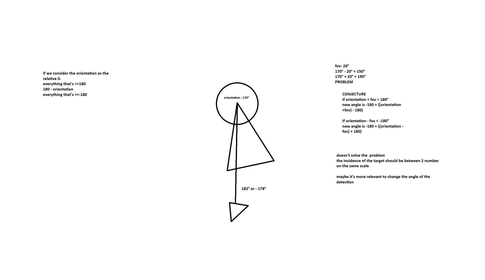

# Air Defence War Game (ADWG) ✈️🚀
*Air Defence War Game is a simulated Air engagement system using C++, ECS data structure & SFML Graphics*
ADWG simulates two team made of a flock of fighter jet and a number between (1 - 3) of AWACS (Airborne Warning and Control System)
The objective of each team being to destroy the other team's AWACSes.
ADWG doesn't simulate Dogfights between fighter jet but rather the long range engagements through missile launch beyind visual range, like in real life.

ADWG has 3 types of entities:
- Fighters 🟥
- AWACS 🔴
- Missiles 🔺

### Technical HIGHLIGHTS
- ECS data structures
- Game object as Entities & Components
- Graphic API as Interface (enable graphics port to order graphical pipelines)
- CMAKE install SFML & builds it
- Vectorial calculation, Azimut detections

## HIGHLIGHTS
ADWG prides itself on delivering a simulations close to real air confrontation through the simulation of multiple interesting and important aspects of modern air combat engagement
ADWG simulates:
- Cinetic flight of aircrafts (turn rate, acceleration, ascension & descension)
- Weight influencing of the craft's cinetic abilities
- Radar detection with range and Field of View
- AWACS' Datalink (intra-team communication)
- Possibility of blue-on-blue casualties

## Cinetic Simulation
The mechanics of flights are very complex to simulate, in ADWG they've been simplified to its core.
In ADWG an aircraft cannot accelerate, turn or ascend instantaniously, each action, whether it is turning, accelerating or descending will take a certain time defined by the weight of the aircraft.

## Weight
Aircraft come loaded with fuel and sometimes missiles, each have simulated weight 1 unit of fuel is a metric ton and 1 missile is a quarter of that 250kg, based on the approximate weight of the AIM-7 SPARROW
Furthermore during flight an aircraft will both consumed fuel and launch missile, descreasing its effective weight and affecting its flight performance. 

## RADAR simulation
During combat, aircraft will RADAR to detect and target their opponents.
In ADWG this is simulated via a cone of vision with a limited range they'll will return the coordinate of a target.

The radar cone is fixed to the aircraft's orientation, therefore, not only can opponents stay out of range of detection they can also bypass detectiong through maneuvering

## AWACS' Datalink
During real engagement information is paramount, knowing where the enemy might be is the first step to victory.
AWACS is a tool made for the information war, it is equiped with radar with much wider range and datalink.
In ADWG, Datalink is a tool that will the AWACS to share targets with their fighters.
This sharing of informations forms the backbone of the AWACS defense but also the team's overall Attack effectiveness.

## Blue-on-blue casualties
In air engagement is it not uncommon to launch a missile and leave it unsupervised, these missile dubbed "fire & forget", but missile can sometime fail to track the right target, landing unfortunately on an allies in the worst cases.

In ADWG, this is simulated by following missile behaviour, when launch from an aircraft, it will go to the closest radar detected enemy. If the enemy leaves the radar cone of the launching aircraft, the missile default to going to the closest entity the missile's radar detects